# Flexible Pomo Timer for Obsidian

Simple plugin that displays a [pomodoro timer](https://en.wikipedia.org/wiki/Pomodoro_Technique) in the [Obsidian](https://obsidian.md/) status bar. 

## Use
Click the clock icon in the left ribbon panel to start. Click again to toggle pause.

All of these actions are available from the command pallete. You can also set a hotkey to quit the timer.

## Typical Workflow

The typical workflow in Flexible Pomodoro is to **Start** your Pomodoro.

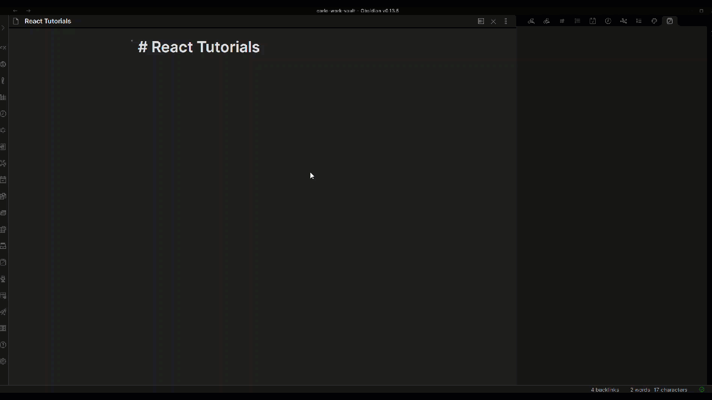

Do your work and at the end of the 25 minute period, you will be asked if you want to extend or not.

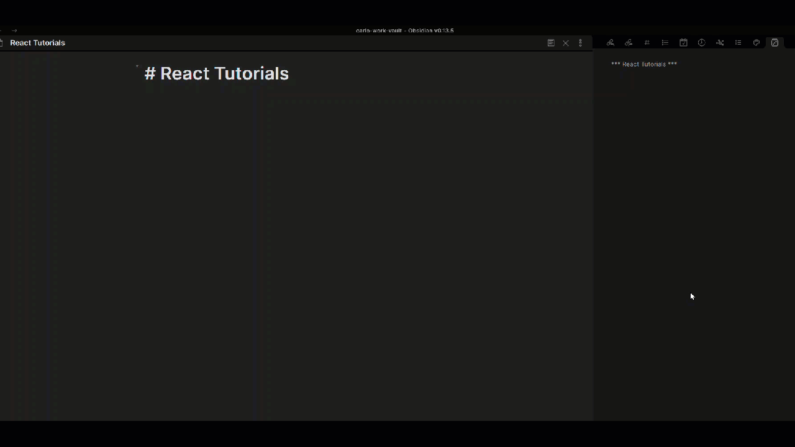

If you choose **Yes**, your pomodoro will extend a stopwatch will appear instead of a countdown timer. If you choose **No**, a Break timer will start. If you choose **Not For This Session**, the normal pomodoro cycle timers will kick in.

Use **Log And Quit** and **Workbench**. Having this option has made it more easily to move from one task to another 
without being bound by the 25 minutes, thus making it **Flexible**. You can also extend beyond the 25 minute interval
if you choose Yes.

Use **Log And Quit** when you want to finish your Pomodoro early or if you have extended your Pomodoro and wanted to finish.

Use the **Workbench** to track multiple files and the checkboxes/tasks that you create in them. **Start A Pomodoro** first to use the workbench. Use **Link Active File To Workbench** to add files other than the originally started one into the workbench. When you use **Log And Quit**, all the details will be logged into your daily note or Pomodoro Log.

After log and quit, please view your **Daily Note** or **Pomodoro Log** to get details of all the things that you did.

Workbenches will help you track your current state of mind.

Use keyboard shortcuts to make everything easier.

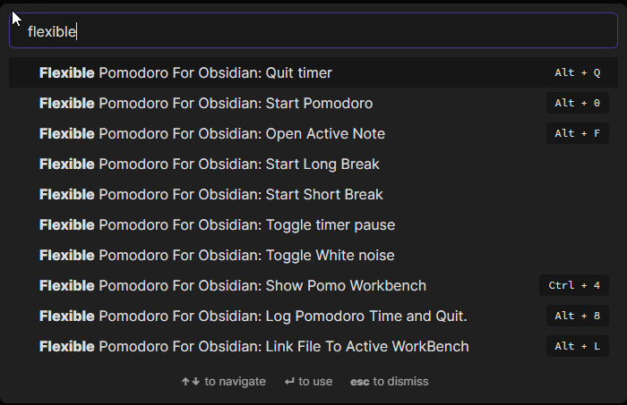

## Roadmap

- [ ] Add summary logging for pomodoro
- [ ] Add rest tracking.
  - [ ] Add sound indicator for rest.
  - [ ] Add rest time to logging.
- [X] Add better task tracking for pomodoros.
  - [X] Include completed tasks/new tasks for Active Note.
- [ ] Pomo Workbench
  - [X] Track multiple files during a pomodoro period.
  - [X] Add current progres indicator.
  - [X] Add active file indicator in pomo workbench leaf.
  - [ ] Add automatic Linking Mode.
  - [X] handle renames and deletes
  - [X] handle move files
  - [X] Option to have a persistent workbench
  - [X] Persistent work bench across restarts.
  - [X] Option to save workbench types.
  - [ ] Option to include Daily Note in WorkBench/logging.
  - [X] Option to change order of notes in workbench.

## Settings

You can change the duration of the pomodoro timer, breaks, and interval between long breaks, and toggle the end of timer sound and white noise.

Autostart timer allows you to toggle whether the next break or pomodoro start automatically after the next, or waits for you to start it. If disabled, you can specify a number of pomodoro-and-break cycles that run automatically (for instance, if you want to run two pomodoros and their corresponding breaks without stopping and then pause, enter 2).

### Logging

If you enable logging, the plugin will write to the file you specify as your log file at the end of each pomodoro. If no such file exists, it will be created at the end of your first pomo. By default, the log message is "🍅 dddd, MMMM DD YYYY, h:mm A" (e.g. "🍅 Friday, July 16 2021, 6:18 PM"), but you can specify your own message using [moment display format](https://momentjs.com/docs/#/displaying/format/).

"Log to daily note" will append the log to the daily note. Please note that this currently *only* works by appending to the end of the file.

"Log active note" will include a link to the active note at the time the pomodoro timer started in the log message.

You can open the current log file by clicking the timer.

## Flexible Pomodoro Features

### Early Logging and Quitting

For tasks that were finished much earlier, the tool provides additional commands for logging and quitting. Once triggered, the application will already log the Pomodoro and stop the timer.
For this to work, Pomodoro logging should be turned on in options.

### Show Active Note In Status Bar

When this option is turned on the active note will be shown in the pomodoro timer.

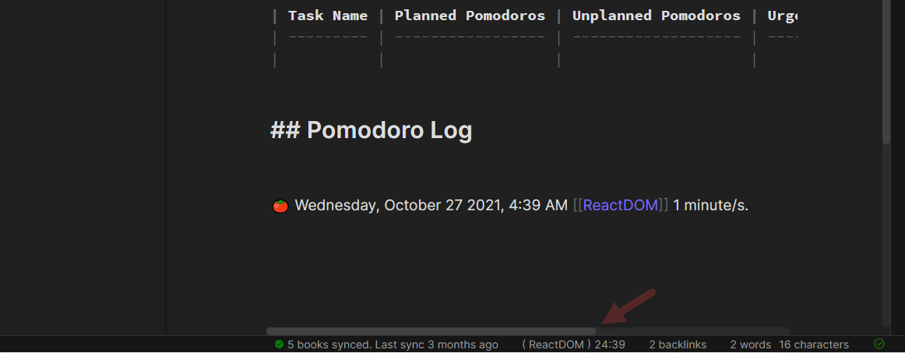

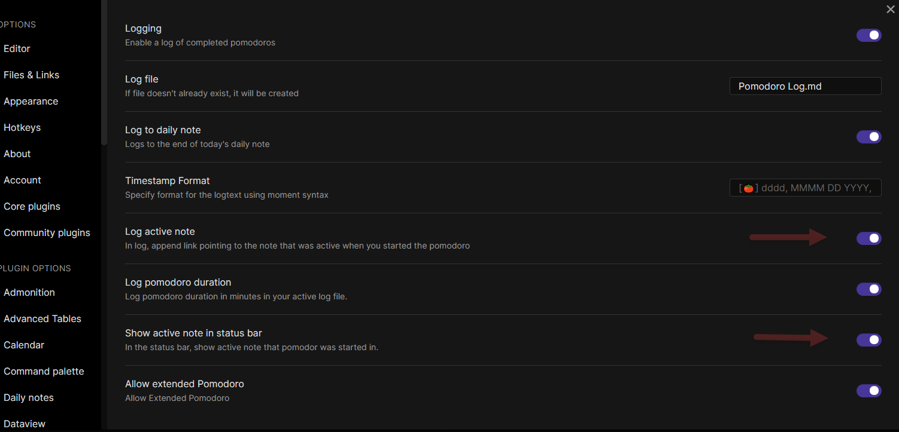

For this to work, options should enable 

### Extended Pomodoro

For Pomodoro users that want to work outside of the pomodoro time limit, this option provides a flexible option to extend your Pomodoro.
If you choose to extend, a stop watch will start to log the pomodoro. If you choose not to extend, the next break will start already.

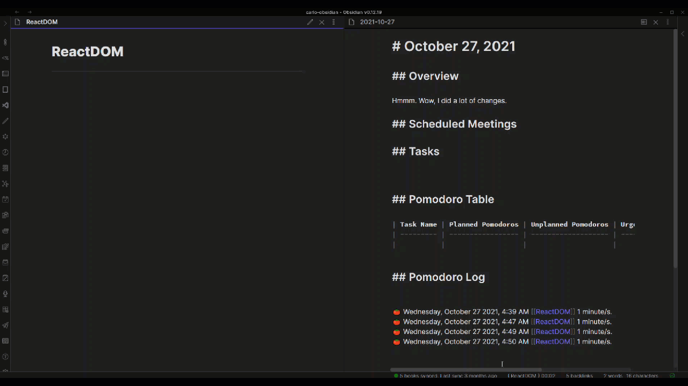

Please use Log Pomodoro Time and Quit so that extended pomodoros are logged and recorded.

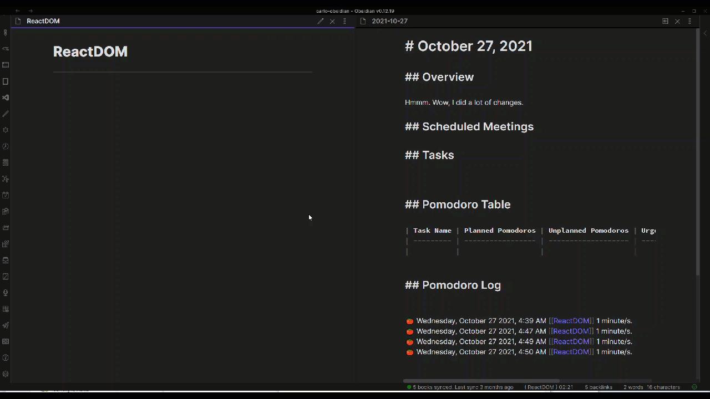

### Log Pomodoro Duration

Added an option so that pomodoro duration is logged.

### Enable Normal Pomodoros For Session

At the end of the pomodoro, you can have a choice to use normal pomodoros for the rest of the session. This reverts to 
the original pomodoro mode.

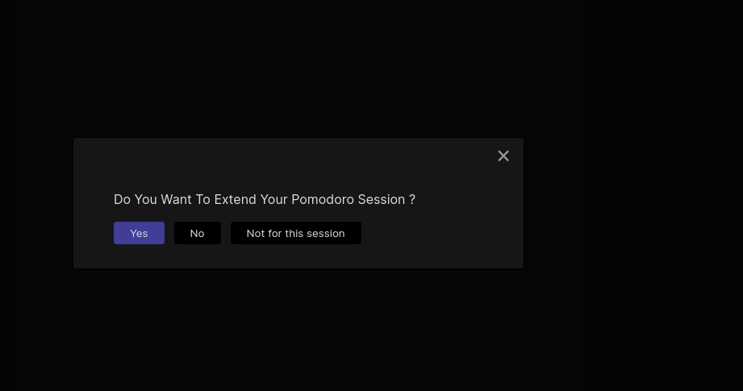

### Better Visual Indicator

Added a visual indicator based on https://github.com/third774/react-stopwatch

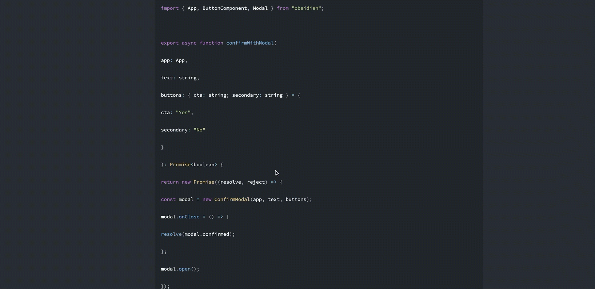

### Log Pomodoro Tasks

Added tracking of Pomodoro Tasks. These are the checkboxes inside. It will track all of the tasks that were ticked 
during a Pomodoro Session of the current Active Note. Tasks will only be tracked in the Active Note and it will only be tracked
when the Pomodoro is in active note. Tracking will not work during breaks.

Note: There is a current limitation that tracking is only based on text of files. Duplicates might not be tracked properly.

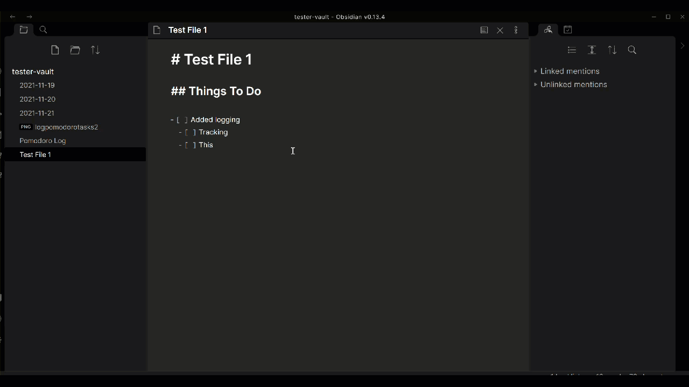

Please be sure to enable in settings.

### Pomo Workbench

The workbench is a feature that you can use to have multiple files tracked during a Pomodoro period.
This will enable the user to log tasks added and completed with these multiple files.

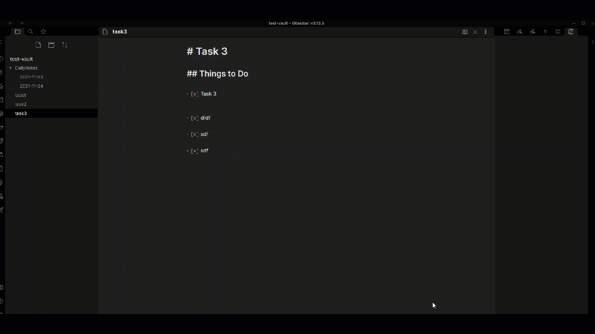

### Persistent Workbench

Persistent workbenches enable you to save different types of Workbenches in a folder in your vault. This enables the plugin
to persist Workbenches across restart and enables the user to save different types of workbenches.

Please be sure to set your workbench folder first. Workbench Files that are saved will be placed in this folder.

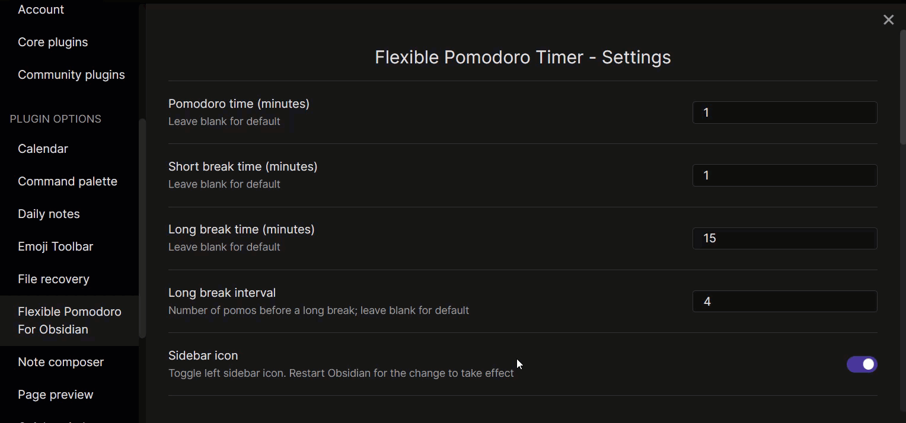

### Save Pomo Workbench As

Save your workbench

To make a workbench persistent, be sure to call **Save Pomo Workbench As** command. 

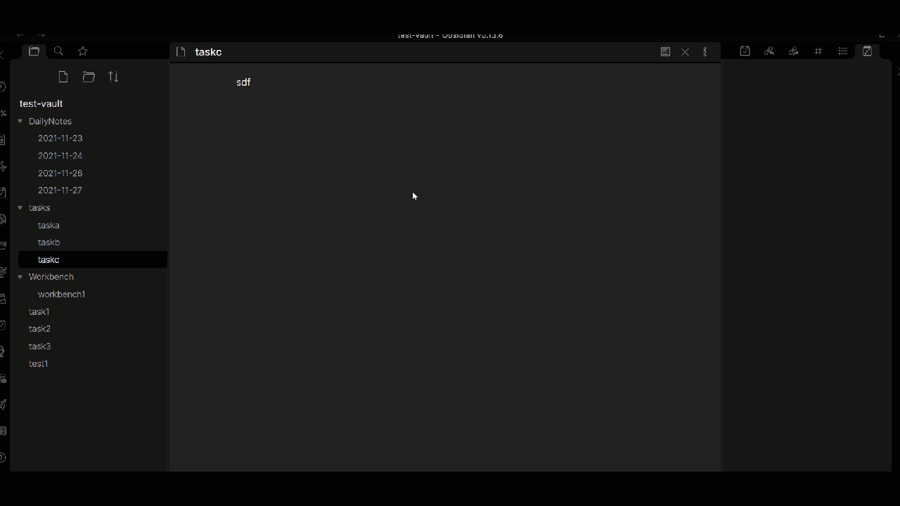

### Load A Workbench

Load a workbench  command loads previously created workbenches.

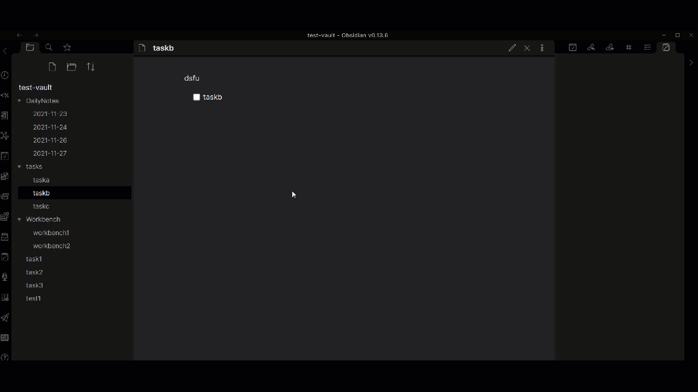

### Sortable Workbench

Additional commands have been added to sort the workbench contents. 

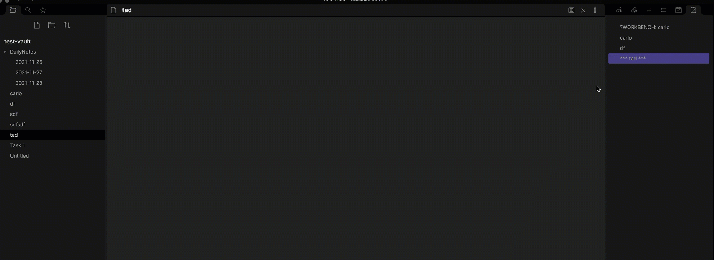

### Additional Commands

#### Start Short Break

Starts a short break manually.

#### Start Long Break

Starts a long break manually.

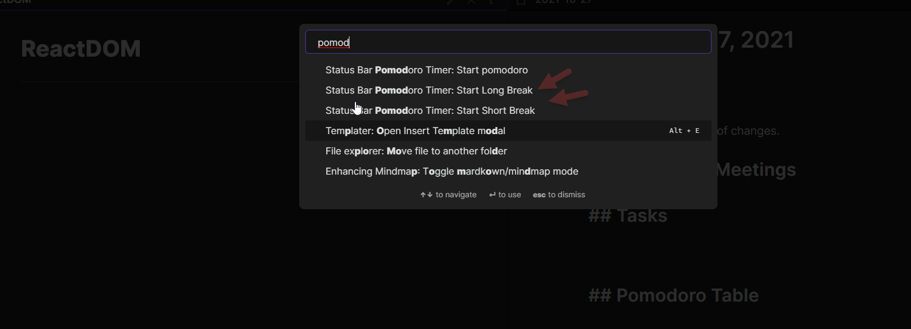

#### Reveal Active Pomdoro Note

Reveals the active Pomdoro note to the right pane.

#### Save Pomo Workbench As

Save the Pomo workbench to a file. You can choose a new one or an old one. Saving overrides all the contents of the file
but history is still stored in your Workbench folder.

Files will be persisted in your workbench folder.

#### Save Pomo Workbench

Save Pomo Workbench commands enable you to save the current state of your workbench if you linked or unlinked any files.
It can also be called when the order is changed. A new version will be stored inside your Workbench file.

#### Load Pomo Workbench

Loads a previously created Pomoworkbench.

#### Unload Pomo Workbench

Enables you to unload the current persistent workbench loaded.

#### Link Active File To Workbench

Adds a File to the current pomodoro workbench.

#### Unlink Active File From Workbench

Removes  a file from the current pomo workbench.

#### Show Pomo WorkBench

Reveals the pomo workbench in the right leaf.

#### Clear Pomo WorkBench

Clears the pomo workbench. Active note will not be removed if timer is active and not on a break.

#### Toggle Workbench Location

Changes the location of workbench from left to right or vice-versa.

Note: Manual workbench moves are not tracked. You will need to trigger command twice.

#### Show Current Progress

Invokes a modal that shows the current task items that are new or ticked during a Pomodoro sequence.

#### Move Note Up

Moves the current Active Note up in the Workbench.

#### Move Note Down

Moves the current Active Note down in the Workbench.

