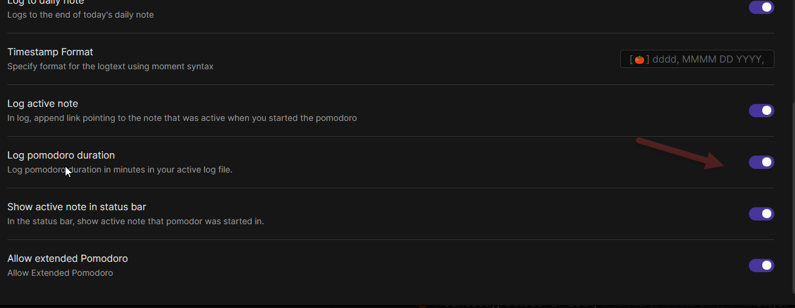

# Flexible Pomo Timer for Obsidian

Simple plugin that displays a [pomodoro timer](https://en.wikipedia.org/wiki/Pomodoro_Technique) in the [Obsidian](https://obsidian.md/) status bar. 

## Use
Click the clock icon in the left ribbon panel to start. Click again to toggle pause.

All of these actions are available from the command pallete. You can also set a hotkey to quit the timer.

## Settings

You can change the duration of the pomodoro timer, breaks, and interval between long breaks, and toggle the end of timer sound and white noise.

Autostart timer allows you to toggle whether the next break or pomodoro start automatically after the next, or waits for you to start it. If disabled, you can specify a number of pomodoro-and-break cycles that run automatically (for instance, if you want to run two pomodoros and their corresponding breaks without stopping and then pause, enter 2).

### Logging

If you enable logging, the plugin will write to the file you specify as your log file at the end of each pomodoro. If no such file exists, it will be created at the end of your first pomo. By default, the log message is "🍅 dddd, MMMM DD YYYY, h:mm A" (e.g. "🍅 Friday, July 16 2021, 6:18 PM"), but you can specify your own message using [moment display format](https://momentjs.com/docs/#/displaying/format/).

"Log to daily note" will append the log to the daily note. Please note that this currently *only* works by appending to the end of the file.

"Log active note" will include a link to the active note at the time the pomodoro timer started in the log message.

You can open the current log file by clicking the timer.

## Flexible Pomodoro Features

### Early Logging and Quitting

For tasks that were finished much earlier, the tool provides additional commands for logging and quitting. Once triggered, the application will already log the Pomodoro and stop the timer.
For this to work, Pomodoro logging should be turned on in options.

### Show Active Note In Status Bar

When this option is turned on the active note will be shown in the pomodoro timer.

For this to work, options should enable 

### Extended Pomodoro

For Pomodoro users that want to work outside of the pomodoro time limit, this option provides a flexible option to extend your Pomodoro.
If you choose to extend, a stop watch will start to log the pomodoro. If you choose not to extend, the next break will start already.

Please use Log Pomodoro Time and Quit so that extended pomodoros are logged and recorded.

### Log Pomodoro Duration

Added an option so that pomodoro duration is logged.

### Enable Normal Pomodoros For Session

At the end of the pomodoro, you can have a choice to use normal pomodoros for the rest of the session. This reverts to 
the original pomodoro mode.

### Additional Commands

#### Start Short Break

Starts a short break manually.

#### Start Long Break

Starts a long break manually.

#### Reveal Active Pomdoro Note

Reveals the active Pomdoro note to the right pane.

